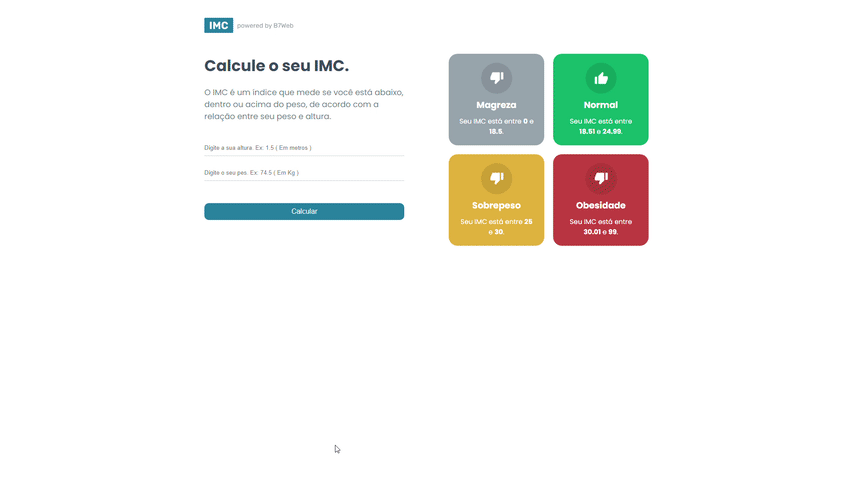

<h1 align="center">CALCULADORA DE IMC</h1>

> 🔎 Calcule o seu IMC e veja se pode dar uma abusada no final de semana 😆.  
🗔 Confira a aplicação: https://react-calc-imc-livid.vercel.app/  
## Explicação
Quem aí não gosta de dar uma ultrapassada dos limites no final de semana com amigos ou família haha? A calculadora de IMC permite ver seu indíce de massa corporal e analisar se pode dar uma abusada na alimentação.

O projeto foi desenvolvido com a biblioteca ReactJS utilizando o método CSS Modules para estilização. 
Uma página dinâmica com interface interativa e 100% responsiva para poder consultar em qualquer dispositivo.

Neste projeto apliquei meus conhecimentos adquiridos sobre estilização com ReactJS, de diversos métodos aprendidos optei por aplicar o CSS Modules.
Nele também pude na prática aplicar a lógica por meio de um projeto React e isso me desafiou em relação a estruturas de componentes de forma mais efetiva, exibições condicionais, uso de States e organização de pastas.

## 📁 Páginas

O site tem no total 1 página, sendo ela

- **Página principal:** A interface principal do cálculo do IMC.

## 🎯 Etapas 

:heavy_check_mark: Criando o projeto com CRA.  
:heavy_check_mark: Buscando recursos necessários como imagens e cores.  
:heavy_check_mark: Desenvolvendo o lado esquerdo onde contém os campos para adicionar os valores.  
:heavy_check_mark: Adicionando verificação de campo preenchido e relacionando a value do campo à uma State.  
:heavy_check_mark: Criando o arquivo TS onde contém o array com as categorias e calcula o IMC.  
:heavy_check_mark: Criando o Lado direito onde contém as categorias baseado no array criado na etapa anterior.  
:heavy_check_mark: Fazendo o sistema funcionar (Retornando o IMC referente aos dados do usuário).  
:heavy_check_mark: Habilitando Disabled nos campos quando é retornado um resultado.  
:heavy_check_mark: Tornando o projeto responsivo.  
:heavy_check_mark: Projeto completo.  

## 🚀 Tecnologias 

- [ReactJS](https://pt-br.reactjs.org/)

## 🤝 Colaboradores

Agradecemos às seguintes pessoas que contribuíram para este projeto:

<table>
  <tr>
    <td align="center">
      <a href="#">
         
        
          <b>Klaus Morotti</b>
        
      </a>
    </td>
  </tr>
</table>

## 📝 Licença

Este projeto está sob licença. Consulte o arquivo <a href="https://github.com/klausmorotti/react-calc-imc/blob/master/LICENSE">LICENSE</a> para obter mais detalhes.

<a href="#top">Volte para o topo</a>
